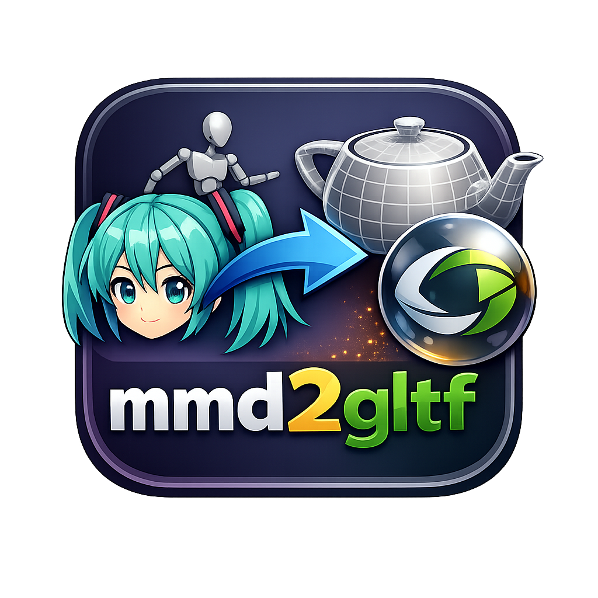
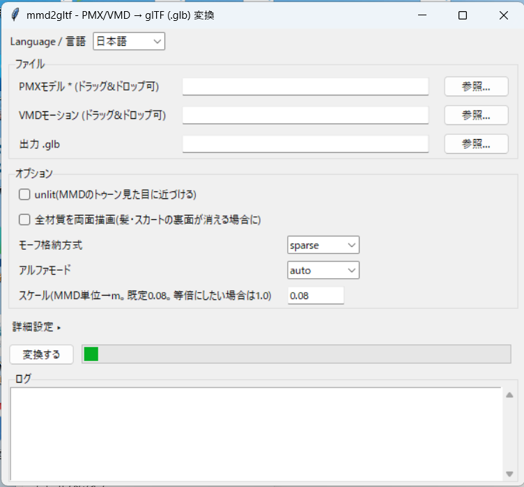

<p align="center">
  
</p>

# mmd2gltf


**[日本語](README.md) | English**

A tool that converts MMD PMX models (plus VMD motions) to **glTF 2.0 (.glb)** as faithfully as possible. Works as **both a GUI and a CLI**. Runs on the Python standard library alone; Pillow is only needed for texture conversion (BMP/TGA/sph/spa → PNG).

Includes a **physics-baking feature** that bakes rigid-body physics (hair, skirts, ties, etc.) into bone animation, so secondary motion plays back naturally even in glTF viewers that have no physics engine.

The real goal of this tool is not just viewer-oriented conversion, but **carrying MMD data out to other formats and environments as accurately as possible** (see [Goal of this tool](#goal-of-this-tool)).

> **▶ Quick start (Windows):** [Download the latest EXE](https://github.com/masaka1024/mmd2gltf-gui/releases/latest) — no Python required.

<p align="center">
  
</p>

## Table of contents

- [Goal of this tool](#goal-of-this-tool)
- [Features](#features)
- [Requirements](#requirements)
- [Windows EXE (no Python needed)](#windows-exe-no-python-needed)
- [Installing the Python version](#installing-the-python-version)
- [Usage](#usage)
- [IK handling](#ik-handling)
- [Physics baking](#physics-baking)
- [Option reference](#option-reference)
- [Viewer compatibility notes](#viewer-compatibility-notes)
- [What gets converted (fidelity)](#what-gets-converted-fidelity)
- [Limitations](#limitations)
- [Tests](#tests)
- [Project layout](#project-layout)
- [License](#license)

## Goal of this tool

The primary purpose of mmd2gltf is to **carry MMD data out to other formats and environments as accurately as possible**. glTF (.glb) is used as the "container" for that journey.

To achieve this, every converted file has a **two-layer structure**:

1. **Preservation layer (`extras.mmd`)** — Everything glTF cannot express — rigid bodies, joints, IK settings, append/grant parents, toon / sphere-map / edge material settings, and more — is **fully preserved as raw PMX values**. A receiving application (a game engine or another tool) can reconstruct the original MMD model's structure from this layer with high fidelity.
2. **Baked layer (standard glTF animation)** — Motion and secondary physics (hair, skirts) are baked into standard keyframes so the model "just looks right" in ordinary glTF viewers that have no physics engine. This layer is an approximate fallback by design.

Physics baking never discards the preservation layer, so you can have both: viewers play the baked motion as-is, while engines rebuild real physics from the raw data.

### Proof of concept: the Unity importer

To verify that this design actually works, an editor extension that reads `extras.mmd` and reconstructs the model inside Unity was developed. The following has been confirmed on multiple models:

- **Rebuilding physics (secondary motion) from the rigid-body / joint data** — Rigidbody / ConfigurableJoint components are set up on the bones, so hair and skirts sway under Unity's real physics engine
- **Restoring MMD-style toon rendering** from the toon / sphere-map / shared-toon / outline material settings (based on lilToon)

In other words, a .glb produced by this tool is not only viewable as-is — it carries **enough information for an engine to bring back real physics and toon shading**.

> The importer is published as a separate repository: **[mmd2gltf-unity-physics-importer](https://github.com/masaka1024/mmd2gltf-unity-physics-importer)** (requires UniGLTF / lilToon, for URP projects; README in Japanese)

## Features

- **No extra libraries required** — runs on the standard library alone (Pillow is optional, for texture conversion only).
- **Full PMX 2.0/2.1 parsing** — meshes, skinning, materials, morphs, and physics data, all sections.
- **VMD motion baking** — evaluates Bézier interpolation and bakes every frame in MMD's exact deformation order (deform hierarchy → append/grant → CCD-IK with axis limits).
- **Physics baking** — simulates rigid-body physics for hair, ties, skirts, etc. and bakes the result into bone keyframes, so secondary motion works in viewers without a physics engine.
- **Fine-grained IK control, 4 modes** — from full bake to "don't solve at all" (see [IK handling](#ik-handling)).
- **Nothing that glTF can't express is lost** — rigid bodies, joints, IK settings, append parents, and more are fully preserved as raw data under `extras.mmd`. Even when physics baking is on, the original physics data stays intact, so a game engine (e.g. Unity) can rebuild real physics from it (see the published [Unity importer](https://github.com/masaka1024/mmd2gltf-unity-physics-importer)).
- **GUI and CLI** — the GUI supports Japanese/English switching and drag & drop.
- **Prebuilt Windows EXE** — download and run without installing Python.

## Requirements

- **Windows EXE** — no Python installation needed; download and run.
- **Python version** — Python 3 (standard library only)
  - Optional: **Pillow** (needed when textures are not PNG/JPG)
  - Optional: **tkinterdnd2** (for drag & drop in the GUI)

## Windows EXE (no Python needed)

If you'd rather not install Python, use the prebuilt EXE.

1. Download the latest zip from the [Releases](https://github.com/masaka1024/mmd2gltf-gui/releases) page.
2. Extract it and double-click `mmd2gltf_gui.exe` (self-contained) to launch the GUI.
3. From there it's the same as the GUI described in [Usage](#usage). Pillow, tkinterdnd2, and numpy are bundled, so no extra installs are needed (drag & drop works in the EXE too).

> **About the first-launch warning**
> This is unsigned, individually developed software, so Windows SmartScreen may show
> "Windows protected your PC" on first launch. Click "More info" → "Run anyway".
> Some antivirus software may also flag PyInstaller-built EXEs as false positives;
> the full source is published in this repository.

## Installing the Python version

Just clone the repository and install the optional libraries as needed.

```bash
# Optional: when textures are not PNG/JPG
pip install Pillow

# Optional: for drag & drop in the GUI (in a uv environment: uv pip install tkinterdnd2)
pip install tkinterdnd2
```

## Usage

### GUI

```bash
python gui.py
```

You can pick files and set the main options (unlit, double-sided, morph storage mode, alpha mode) from the window. Open "Advanced settings" to configure IK options, step, animation name, and **physics baking**. Conversion runs in the background with a live log. The only dependency is the standard library's tkinter.

- You can **drag & drop** files from Explorer onto the PMX/VMD fields (requires `tkinterdnd2`; the "Browse..." buttons still work without it).
- The dropdown at the top right switches between **Japanese/English** at any time (auto-selected from your OS locale on first launch).

### CLI

```bash
python -m mmd2gltf model.pmx -o model.glb
python -m mmd2gltf model.pmx --vmd motion.vmd -o dance.glb

# Also bake hair/skirt physics
python -m mmd2gltf model.pmx --vmd motion.vmd --bake-physics --bake-target all -o dance.glb
```

### From Python

```python
from mmd2gltf import convert
```

## IK handling

When baking a VMD motion, you can choose one of 4 ways to handle IK (inverse kinematics for legs, arms, etc.). **The default full bake is usually what you want**; switch modes when the feet move in unintended ways.

| Mode | Flag | Behavior |
| --- | --- | --- |
| **Full bake (default)** | `--vmd FILE` only | Solves all IK and bakes it into the animation (30fps). IK on/off keys inside the VMD are respected. |
| **Don't solve any IK** | `--no-ik` | Doesn't solve IK at all during baking; outputs only the raw FK curves. |
| **Disable specific IK** | `--disable-ik NAME` | Disables only IK bones whose names contain NAME (repeatable). E.g. `--disable-ik 足` disables just the leg/toe IK. |
| **Ignore VMD IK keys** | `--ignore-vmd-ik` | Ignores IK on/off keys inside the VMD and solves anyway. Useful when a full-key motion sets leg IK to OFF, which the default would honor by not solving. |

**Quick guide**

- Ordinary dance motion → the default (`--vmd` only) is fine.
- Want to inspect the raw curves, or don't like the IK-solved result → `--no-ik`.
- Want to disable only the legs / only the arms → partial selection like `--disable-ik 足`.
- Feet don't track correctly because a full-key motion sets leg IK OFF in the VMD → `--ignore-vmd-ik`.

## Physics baking

With `--bake-physics`, MMD rigid-body physics (hair, ties, skirts, and other secondary motion) is solved with a lightweight physics simulation (a PBD spring model) and the result is **baked into bone keyframes**. Secondary motion then plays back naturally even in glTF viewers that have no physics engine.

> **Design philosophy:** this bake is an approximation aimed at "plausible, modern-looking sway for environments without a physics engine". It does not try to perfectly reproduce MMD's own Bullet physics. If you need faithful physics, use the raw rigid-body/joint data preserved under `extras.mmd` and rebuild it in an engine such as Unity.

### Basic usage

```bash
# Bake hair only (default)
python -m mmd2gltf model.pmx --vmd motion.vmd --bake-physics -o out.glb

# Bake everything including skirts
python -m mmd2gltf model.pmx --vmd motion.vmd --bake-physics --bake-target all -o out.glb
```

- `--bake-target hair` (default) — chain-like secondary parts only (hair, ties, etc.).
- `--bake-target all` — all dynamic rigid bodies including skirts. Skirts go through a cloth solver that preserves ring structures and includes collision handling against body colliders (legs, hips, etc.) to prevent penetration.

### Tuning the sway

| Option | Default | Effect |
| --- | --- | --- |
| `--hair-drag F` | 0.85 | Velocity retention (0–1). Higher = floppier, lower = stiffer. |
| `--hair-stiffness F` | 1.5 | Restoring force toward the rest shape. |
| `--hair-gravity F` | 0.02 | Gravity strength. 0 keeps the rest shape. |
| `--collision-margin F` | 0.01 | Clearance kept between cloth and body colliders, in glTF units. Increase if the skirt visually touches/clips the legs. |
| `--hem-extra-margin F` | 0.0 | Extra clearance applied **only toward the hem** of each skirt chain. It interpolates smoothly from the root (waist, 0) to the hem (1), so it suppresses hem clipping without changing the waist silhouette. |

### Collision modes (fixing clipping and "umbrella" skirts)

On some models, internal rigid-body setups or motions more extreme than the model was designed for can push the skirt outward into an umbrella shape, or pin it into a body part. Two escape hatches are provided:

| Mode | Flag | Behavior |
| --- | --- | --- |
| **Normal (denylist)** | `--force-no-collision NAME` (repeatable) | Makes only the named rigid bodies fully non-colliding; everything else follows the PMX non-collision group settings. Use when you know a specific collider is causing trouble. |
| **Restricted (allowlist)** | `--allowed-collider NAME` (repeatable) | Treats **only** the named rigid bodies as colliders and ignores everything else, bypassing the PMX group settings entirely. Same idea as VRM SpringBone / VRChat PhysBones per-chain collider scoping. |

The GUI makes this easier under "Advanced settings":

- **Collision mode** — radio buttons switch between "Normal / Restricted", with a comma-separated name field.
- **Show rigid body names...** — parses the selected PMX and lists rigid bodies in two groups (static/colliders vs. dynamic/sway parts); double-click to add a name to the field.
- **Use VRM-compatible mode** — a one-click preset that auto-detects leg-area colliders and switches to Restricted mode.

The PMX non-collision groups (group/noCollisionMask) themselves are also read and honored during baking; the modes above are overrides for when those settings aren't enough.

## Option reference

| Option | Description |
| --- | --- |
| `--vmd FILE` | Bake a VMD motion as a glTF animation (with IK solving, 30fps) |
| `--no-ik` | Don't solve any IK during baking (raw FK curves only) |
| `--disable-ik NAME` | Disable only IK bones whose names contain NAME (repeatable; e.g. `--disable-ik 足` for leg/toe IK) |
| `--ignore-vmd-ik` | Ignore IK on/off keys inside the VMD (respected by default; e.g. full-key motions that set leg IK OFF would otherwise not be solved) |
| `--bake-physics` | Bake rigid-body physics into bone keyframes (PBD spring sim); fixes frozen/IK-locked hair, ties, etc. |
| `--bake-target MODE` | Which rigid bodies to bake: `hair` = hair only (default), `all` = all dynamic bodies incl. skirts (cloth solver handles ring structures) |
| `--hair-drag F` | Velocity retention 0–1 (default 0.85; higher = floppier) |
| `--hair-stiffness F` | Rest-shape restoring force (default 1.5) |
| `--hair-gravity F` | Gravity strength (default 0.02; 0 keeps the rest shape) |
| `--collision-margin F` | Clearance kept between cloth and body colliders, in glTF units (default 0.01). Increase if the skirt visually touches/clips the legs; 0 = push exactly to the collider surface |
| `--force-no-collision NAME` | Force the named rigid body to be fully non-colliding, overriding its PMX group/noCollisionMask (denylist escape hatch; repeatable). Use when a specific collider pins/stretches cloth in extreme poses despite the PMX data looking correct |
| `--allowed-collider NAME` | Switch collision to allowlist mode: only the named rigid bodies are treated as colliders at all (repeatable; ignores PMX group/noCollisionMask entirely once any is given). Mirrors VRM SpringBone / VRChat PhysBones-style per-chain collider scoping |
| `--hem-extra-margin F` | Extra clearance added on top of `--collision-margin`, interpolated smoothly from root (0) to hem (1) of each skirt chain, so the waist side is unaffected (default 0.0 = off) |
| `--step N` | Sample every N frames to reduce file size (default 1 = every frame) |
| `--unlit` | Add `KHR_materials_unlit` to materials (closer to MMD's toon look) |
| `--no-extras` | Don't write `extras.mmd` (see below) |
| `--anim-name NAME` | Name for the glTF animation |
| `--morph-mode MODE` | Morph storage: `sparse` = compact (default), `dense` = maximum compatibility (use if faces break in viewers with poor sparse support), `none` = no morphs |
| `--alpha-mode MODE` | `auto` (default) analyzes each texture's alpha distribution and picks OPAQUE/MASK/BLEND, avoiding false BLEND from unused transparent regions of skin textures (fixes see-through / inside-out faces). `opaque`/`mask`/`blend` force one mode for all materials |
| `--force-double-sided` | Render all materials double-sided (same behavior as three.js MMDLoader; use if hair/skirt backfaces disappear) |
| `--scale F` | Uniform scale from MMD units to glTF units (meters; default 0.08). MMD models are conventionally authored at ~1 unit ≈ 8cm (a 160cm character is about 20 units), so leaving it at `1.0` makes models appear ~12.5x too large in glTF viewers. Applied to vertex/bone positions, SDEF params, morph position deltas, and baked animation translations; normals, UVs, rotations, and the raw data under `extras.mmd` (rigid bodies, joints, etc.) are unaffected (the factor used is recorded in `extras.mmd.unitScale`). Adjust (e.g. `--scale 1.0`) if the source model uses a different unit convention |
| `--no-custom-attrs` | Don't emit MMD-specific vertex attributes (`_SDEF_C`/`_SDEF_R0`/`_SDEF_R1`/`_ADDUV1..4`/`_EDGESCALE`/`_WEIGHTTYPE`). **Use this if Blender's built-in glTF importer errors on these attribute names** (the data still remains under `extras.mmd`, so nothing is lost) |

## Viewer compatibility notes

- macOS Quick Look / Preview (RealityKit) doesn't support glTF morph targets at all. Morphs "missing" there is a viewer limitation; the file itself is fine.
- Viewers/loaders with incomplete sparse-accessor support can break meshes when morphs are applied (see-through faces, mouth morphs appearing to deform the wrong area, etc.). In that case convert with `--morph-mode dense` (larger file). **`dense` is also recommended when importing into Unity via UniGLTF/UniVRM.** Even in sparse mode, a zero-filled base bufferView is included, so loaders without sparse support degrade safely to "morphs disabled".
- Verified viewers: three.js-based (gltf-viewer.donmccurdy.com), Babylon.js Sandbox (sandbox.babylonjs.com), and Blender 3.x+ glTF importer.

## What gets converted (fidelity)

Directly representable in glTF:

- Meshes (vertices, normals, UVs, per-material primitive splits)
- Skinning (BDEF1/2/4; SDEF/QDEF approximated with linear blending, original parameters preserved)
- Bone hierarchy (PMX bone order = skin.joints order, so indices stay compatible)
- Vertex morphs → morph targets (compact via sparse accessors), UV morphs → `TEXCOORD_0` targets, group morphs → expanded into composed targets
- Materials (diffuse → baseColor, double-sided flag, alpha-based BLEND detection, embedded textures)
- VMD motion: Bézier interpolation evaluated and baked per frame in MMD's exact deformation order (deform hierarchy → append/grant → CCD-IK with axis limits). Morph keys become a weights animation
- Physics (optional, `--bake-physics`): rigid-body physics simulated and baked as bone rotation + translation keyframes. PMX non-collision groups (group/noCollisionMask) are honored

Everything glTF has no concept for is preserved in full under `extras.mmd` (raw PMX values, MMD left-handed coordinates):

- Rigid bodies and joints (physics), IK settings, append parents, fixed/local axes, display frames
- Bone morphs, material morphs, flip/impulse morph contents
- Material sphere-map / toon / edge / ambient / specular settings and memos
- Per-vertex data kept as custom attributes: `_ADDUV1..4`, `_EDGESCALE`, `_SDEF_C/_SDEF_R0/_SDEF_R1`, `_WEIGHTTYPE`

Coordinate conversion: positions/normals `(x,y,z)→(x,y,-z)`, quaternions `(x,y,z,w)→(-x,-y,z,w)`, triangle winding reversed.

## Limitations

- PMD (legacy format) and PMX 2.1 soft bodies are not supported (convert to PMX with PMXEditor etc.)
- Physics baking is an approximation via a lightweight simulation and does not exactly reproduce MMD's Bullet physics. Collision is handled per bone (rigid body), not per mesh vertex, so with very fast motion the skirt's mesh surface can still visually pass through the body. Motions far more extreme than the model's rigid-body layout was designed for can also break down (this can happen in MMD itself as well). For faithful physics, rebuild it engine-side from the raw data in `extras.mmd`
- MMD's toon shading / sphere maps / edge rendering cannot be reproduced in glTF's PBR, so appearance is viewer-dependent (`--unlit` gets closer)
- Shared toon textures (toon01–10.bmp) ship with MMD itself and are not embedded (the index is preserved in extras)
- VMD camera, lighting, and self-shadow keys are out of scope

## Tests

```bash
python tests/make_test_data.py                # generate synthetic PMX/VMD
python -m mmd2gltf tests/test.pmx --vmd tests/test.vmd -o tests/test.glb
python tests/check_glb.py tests/test.glb      # structural validation
```

## Project layout

```
mmd2gltf/
  pmx.py        PMX 2.0/2.1 parser (all sections)
  vmd.py        VMD parser + Bézier interpolation
  animation.py  MMD-style deformation pipeline (append/grant, CCD-IK) and baking
  bake_hair.py  Physics baking (PBD spring/cloth solver, collision, collision modes)
  gltf.py       GLB builder (sparse accessor support)
  convert.py    Conversion core
  cli.py        CLI
```

## License

The source code of this tool (mmd2gltf) is published under the MIT License. See [LICENSE](LICENSE) for details.

The Windows EXE bundles open-source components such as Python, Pillow, NumPy, tkinterdnd2, tkDnD, and Tcl/Tk. Their licenses are compiled in [THIRD_PARTY_LICENSES.md](THIRD_PARTY_LICENSES.md).
